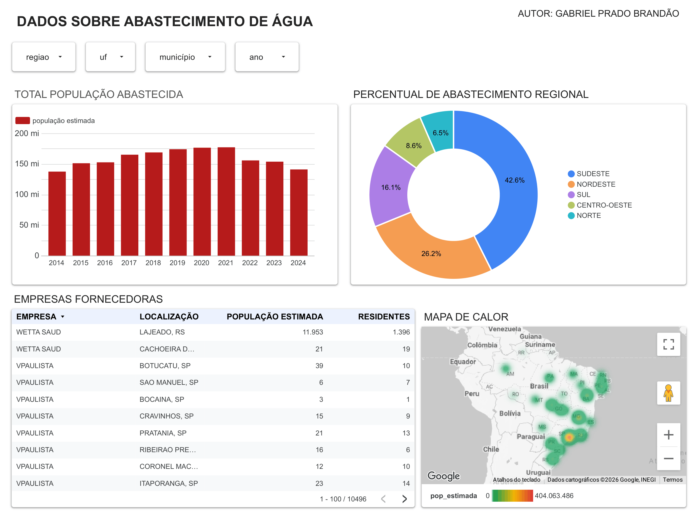

# 🚰 Analytics: Abastecimento de Água no Brasil (SISAGUA)

## 📌 Visão Geral
Este projeto consiste em um dashboard interativo desenvolvido no **Looker Studio** para analisar a distribuição e cobertura do abastecimento de água no Brasil entre **2014 e 2024**, utilizando dados públicos do **SISAGUA / Ministério da Saúde**.

🔗 **[Acesse o Dashboard Interativo Aqui] (https://datastudio.google.com/s/lDiTKYWh1xU**)

---

## 🛠️ Tecnologias & Ferramentas
- **Visualização & Dashboard:** Looker Studio
- **Fonte de Dados:** Dados abertos do SISAGUA (Ministério da Saúde)
- **Armazenamento e Camada de dados:** Google Planilhas *(Data Source do Looker Studio)

---

## 📊 Arquitetura do Painel & Componentes

O painel foi projetado para oferecer navegação intuitiva por meio de filtros dinâmicos de **Região, UF, Município e Ano**:

1. **Evolução Temporal (2014–2024):** Gráfico de colunas que exibe a estimativa de população abastecida ao longo da última década.
2. **Distribuição Regional:** Gráfico de rosca destacando o percentual de cobertura por macrorregião.
3. **Mapeamento Geográfico:** Mapa de calor de densidade para rápida identificação de zonas com maior volume de população atendida.
4. **Detalhamento Operacional:** Tabela consolidada com dados por empresa fornecedora, localização e número de residentes.

---

## 💡 Principais Insights Identificados

- **Concentração Regional:** A região **Sudeste** representa a maior fatia da população estimada abastecida (**42,6%**), seguida pelo **Nordeste** (**28,2%**).
- **Estabilidade na Cobertura:** O histórico entre 2014 e 2024 indica estabilidade no volume populacional atendido, com picos observados entre 2019 e 2021.
- **Granularidade Local:** Permitiu rastrear discrepâncias entre estimativas populacionais e residentes atrelados a empresas fornecedoras específicas.

---

## 🚀 Como Replicar ou Explorar
1. Acesse o [link do Looker Studio] (https://datastudio.google.com/s/lDiTKYWh1xU)
2. Utilize o menu superior de filtros para segmentar por **UF** ou **Região**.
3. Interaja com os mapas e tabelas para detalhar a análise por município ou empresa.

---

## ✉️ Contato
Desenvolvido por **Gabriel Prado Brandão**  
- [LinkedIn] (https://www.linkedin.com/in/gabriel-prado-brand%C3%A3o-816a1a430/)
- [GitHub] (https://github.com/Gab625)
